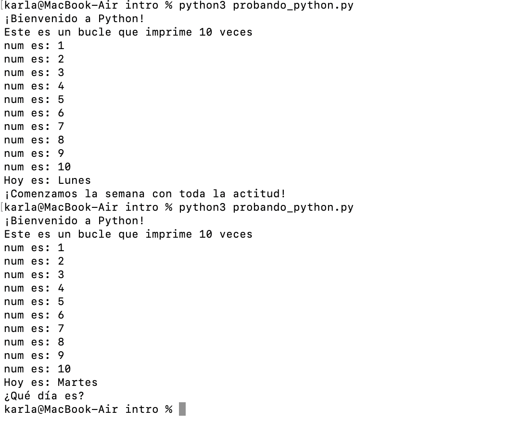
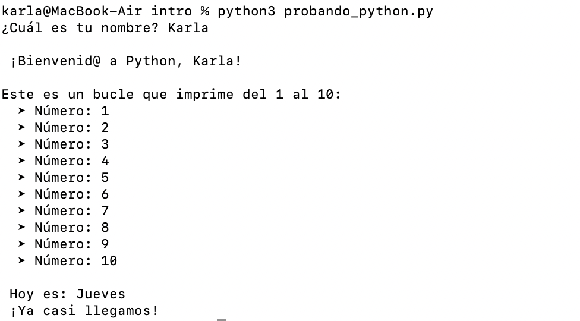

# Descripción del Proyecto

**************

las imágenes de testeo de este proyecto están abajo de este documento

**************

Primero, el programa importa la librería `datetime`, que se usa para obtener información sobre la fecha y hora del sistema. En este caso, nos interesa saber qué día es hoy.

Luego, se solicita al usuario que ingrese su nombre mediante la función `input`. El valor que entrega el usuario se almacena en una variable y se utiliza para mostrar un saludo personalizado. Esto hace que el programa sea más cercano y dinámico.

A continuación, se ejecuta un bucle que imprime los números del 1 al 10, una forma simple de practicar estructuras repetitivas en Python.

Después de eso, el programa define dos diccionarios. El primero se utiliza para traducir el nombre del día actual (obtenido en inglés por defecto desde la función `datetime.today()`) al español. El segundo contiene un mensaje motivacional distinto para cada día de la semana.

Finalmente, el programa determina qué día es hoy, lo traduce al español utilizando el primer diccionario, y luego selecciona y muestra el mensaje correspondiente con ayuda del segundo diccionario.

En caso de que por alguna razón no se reconozca el día, se muestra un mensaje por defecto que indica que no hay mensaje disponible para ese día.
A continuación se muestran 

Capturas de pantalla durante el proceso de desarrollo:
PRINT UNO PROGRAMA ORIGINAL TESTEADO 2 VECES

PRINT DOS PROGRAMA CON MODIFICACIONES 
